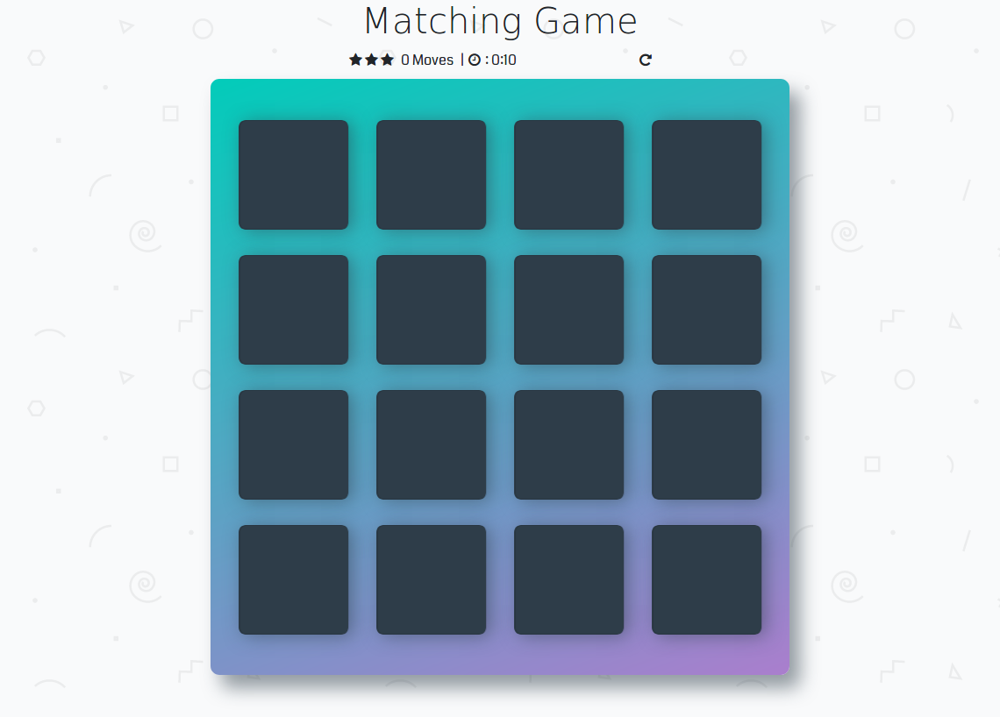
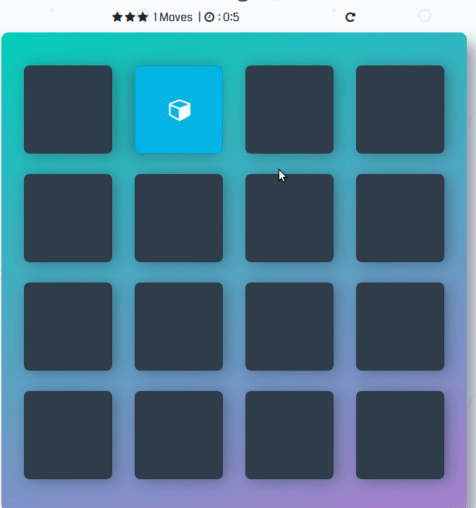
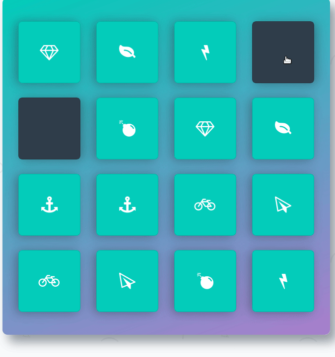
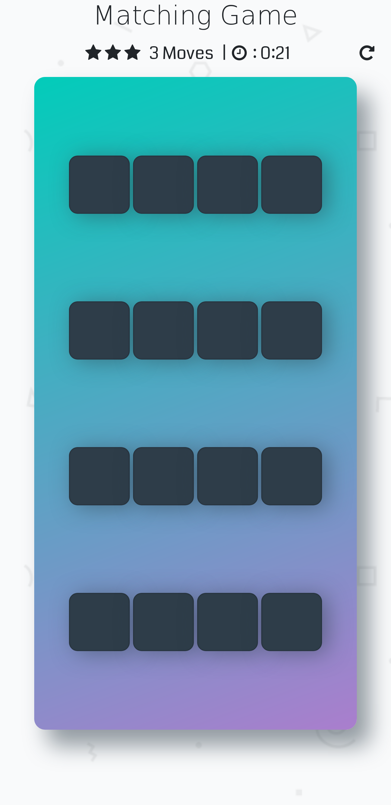
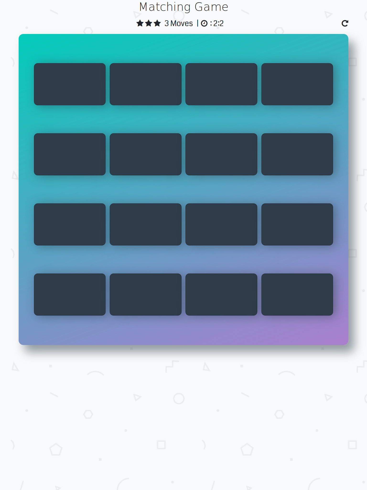

# Memory Game Project ♥️ ♥️ ♥️ . 

## Table of Contents
* [Instructions](#instructions)
* [Screenshot](#screenshot)
* [HowPlayWork](#howplaywork)

## Instructions
Styling this game by using **HTML** , **CSS** and **Javascript**  😍 😍  to make rules of game 💪  

## ScreenShot 

## How Play works:
 - click card 🔲
 - find the matching flipped card 🗃
 - see your scores after matching all cards 💪 
 - see how long time your spend of each round 😌

 

